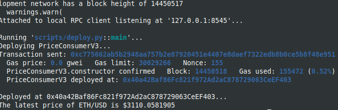

Study case about consuming data feeds from Chainlink [Chainlink, Using Data Feeds](https://docs.chain.link/docs/get-the-latest-price/)

I used brownie with hardhat in order to deploy and use the console.log features.
You should start the hardhat node in another terminal and folder (`hh node`), then, in a terminal :

```
brownie compile
brownie run scripts/deploy.py
```

The MockV3Aggregator is deployed on local networks too.

Deployment from brownie, on mainnet-fork-dev:

